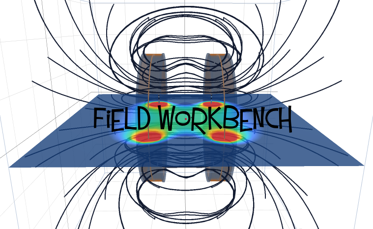

# Field Workbench

### A 3D Workspace for Biological Magnetic-Field Visualization



## Table of Contents

1. [Introduction](#1-introduction)
2. [Contribute and Collaborate](#2-contribute-and-collaborate)
3. [Getting Started](#3-getting-started)
4. [Tutorials and Demonstrations](#4-tutorials-and-demonstrations)

## 1. Introduction

Field Workbench (FWB) is an open 3D workspace for designing, visualizing, documenting, sharing and comparing magnetic-field exposures used in ELF biological research.
Field Workbench simplifies the magnetic modeling workflow, and provides built-in tools specific to biological research.
These include various specimen trays, a generic bust, an SRI24-derived brain and UPENN-GBM tumour models.
Model export provides a path to several popular electromagnetic modeling software packages such as FEMM, Gmsh/GetDP and COMSOL (untested).

## 2. Contribute and Collaborate

Field Workbench is under active development. Any and all participation is welcome. This can include, but is not limited to, workflow testing, model validation, technical review, object or feature requests etc. Start a discussion on where you'd like to see Field Workbench go! Details below.

## 3. Getting Started

### Windows

1. Download and extract the [windows zip file]().
2. Extract the field_workbench folder.
3. Click the fieldworkbench exe.
4. You may need to allow the program to run if it is blocked (click more info--> allow this program).

### Linux

Tested in debian bookworm x64 only.
1. Download and extract the source zip file.
2. Install the base dependencies from requirements.txt.
It is recommended to use a virtual environment. Example:

```
unzip FieldWorkbench_x.x.x.x.zip
cd field_workbench
python3 -m venv .venv
source .venv/bin/activate
python -m pip install --upgrade pip
python -m pip install -r requirements.txt
```

3. To launch, enter the virtual environment and start app.py:
```
source .venv/bin/activate
python app.py
```

## 4. Tutorials and Demonstrations

Feature highlights: https://youtu.be/Dzqq4sYlIf8

Maxwell Coil demo: https://youtu.be/poaRiSmKelA


---

Field Workbench is licenced under the [GPL](PROJECT_NOTICE.txt),
some components are seperately licenced by their respective authors.
See [third party notices.](THIRD_PARTY_NOTICES.txt)
